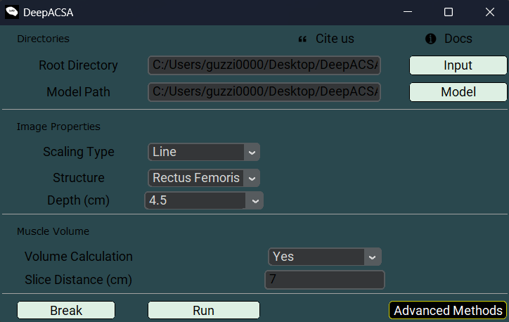
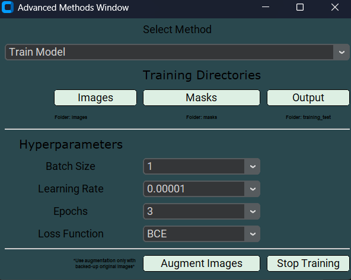

.. _testlabel:

Tests
=====

Image analaysis
"""""""""""""""
DeepACSA currently does not include formal unit testing.
However, the ``DeepACSA_example_v0.3.2.7z`` folder available for download `here <https://zenodo.org/record/8419487>`_ contains an ``images_test`` folder with three rectus femoris images and an ``Original_Results.xlsx`` file.
These files can be used to verify that your setup is functioning correctly. To do so, follow the steps below after downloading the files as described in the :ref:`Installation <installation>` section:

1. In the ``C:/Users/your_user/Desktop/DeepACSA_example_v0.3.2/executable/`` folder double click ``DeepACSA_v0.3.2.exe`` to open the GUI.
2. Click the **Input** button and select the root directory: ``C:/Users/your_user/Desktop/DeepACSA_example_v0.3.2/images_test/``.
3. Click the **Model** button and select the model: ``C:/Users/your_user/Desktop/DeepACSA_example_v0.3.2/models/VGG16pre-RF-256.h5``
4. Select the Scaling type **Line**, structure **Rectus Femoris**, and an image depth (**Depth (cm)**) of **4.5**.
5. Set the **Volume Calculation** to **Yes** and keep the **Slice Distance (cm)** at **7**.
6. Click **Run**
7. After the analysis (which takes only a few seconds), two new files should appear in the ``C:/Users/your_user/Desktop/DeepACSA_example_v0.3.2/images_test/`` folder: ``Analyzed_images.pdf`` and ``Results.xlsx``.
8. Compare your results with those in ``Original_Results.xlsx``. If the results are identical, DeepACSA is working correctly. In theory, each pre-trained model should produce similar results.

Model training
""""""""""""""
To test wheter the model training option included in DeepACSA is functional, follow these steps:

1. In the ``C:/Users/your_user/Desktop/DeepACSA_example_v0.3.2/executable/`` folder, double click ``DeepACSA_v0.3.2.exe`` to open the GUI.
2. Click on **Advanced Methods** and select **Train Model** from the drop-down menu in the newly opened window.
3. Click the **Images** button and select the image directory: ``C:/Users/your_user/Desktop/DeepACSA_example_v0.3.1/training_test/images``. 
4. Click the **Masks** button and select the mask directory: ``C:/Users/your_user/Desktop/DeepACSA_example_v0.3.1/training_test/masks``.
5. Click the **Output** button and select the output directory: ``C:/Users/your_user/Desktop/DeepACSA_example_v0.3.1/training_test/``.
6. Leave all training hyperparameters as specified (**Batch Size** = 1, **Learning Rate** = 0.00001, **Epochs** = 3, **Loss Function** = BCE) and click the **Start Training** button.
7. A first pop-up window will inform you whether the images and masks have been properly loaded. A second pop-up window will inform you that the model has been compiled. Once you click "OK", the training will start.
8. Once the training process is completed, you should find a ``Training_Results.tif`` plot, a ``Test_Apo.h5`` model file and a ``Test_apo.csv`` file containing the per-epoch training and validation metrics (i.e, IoU, accuracy, loss, and learning rate) in the output directory. If this is the case, the training process was succesful.

