.. _usagelabel:

Usage
=====

Welcome to the DeepACSA tutorial. 
Here you will learn how to automatically analyse ultrasonography images of human lower limb muscles. 
You will do so by making extensive use of the graphical user interface (GUI) provided by DeepACSA. 

| The basic functionality of the GUI is demonstrated in the following sections. We guide you through a logical, practice-oriented example that illustrates how each feature can be implemented within a typical laboratory workflow.
| You will find detailed instructions below on how to analyze ultrasound images manually, train your own neural networks, perform automated analysis, and calculate muscle volume as part of this structured example. 
| Have fun!

What is covered on this page:
-----------------------------

* :ref:`Image preprocessing and anonymization <removeparts>`
* :ref:`Manual data labeling and mask creation <datalabel>`
* :ref:`Image augmentation <augmentlabel>`
* :ref:`Training your own model <trainlabel>`
* :ref:`Automatic image analysis with models <automatic_analysis_label>`
* :ref:`Mask inspection and quality control <masklabel>`
* :ref:`Muscle volume calculation <volumelabel>`

**Attention macOS users:**

| The DeepACSA package is only fully functional on Windows OS and was not properly tested on macOS. However, with restricted functionality macOS users can use DeepACSA as well. 
| With macOS, the manual scaling option for image analysis is not functional. Therefore, images cannot be scaled this way in the GUI. A possible solution is to scale the analysis results subsequent to completion of the analysis. 
| Therefore, the pixels per centimeter must be calculated elsewhere. One option is to use `FIJI <https://imagej.net/software/fiji/downloads>`_. By drawing a line on the image, it is possible to see the length of the line in pixel units. Open the respective image in FIJI by drag and drop. Draw a line on the image with a known distance of one centimetre, click ``cmd + m`` and get the length of the line in pixel units from the result window. 
| Repeat this procedure for images acquired at different scanning depths. Determine the pixel-to-centimeter conversion factor (pixels per centimeter) for each image. To convert ACSA values from pixels to cm², divide the predicted area (in pixels) by the square of the pixel-per-centimeter value.

Good to know
------------

All relevant instructions and guidelines for the installation of the DeepACSA software are described in the :ref:`installation section <installation>`, so please take a look there if anything is unclear. We have also provided information on what to do when you encounter problems during the installation process; encounter errors during the analysis process that are not caught by the GUI (no error message pop ups and advises you what to do); want to :ref:`contribute <contributelabel>` to the DeepACSA software package, and how you can reach us.

Before we start with this tutorial, here are some important tips:

* In case you plan an analysis on images taken from different muscles, we strongly advise to test the algorithm first and in case of bad performance, train your own models. We have provided extensive documentation on how to do so in the :ref:`Training your own network section <trainlabel>` in this tutorial.

* Bad model performance can be detected. The first and easiest step to take is to :ref:`visually inspect <masklabel>` the output of the models. If the segmentation results and the actual aponeuroses overlap on most of the analysed images, model performance is good. Secondly, you should manually analyse a few of your images and compare the model results to your manual results. If both results are similar, model performance is good, if not, train a separate model.

* Although we used extensive data augmentation during the model training process, we caution users about the generalizability of our models. Deep learning is no magic! Even though our model demonstrated good performance on unseen images during testing, we cannot confidently claim that they will work fine on all lower limb ultrasonography images. Model performance may be affected by variations in device type, anatomical region, or ultrasound acquisition settings; even when analyzing muscles that were included in the training dataset. 

* Quality matters! Ensure that the images you intend to analyse with DeepACSA are of high quality. High quality implies good image contrast, appropriate brightness, clearly visible aponeuroses, and proper probe alignment perpendicular to the muscle plane. If the quality of the images you want to analyse is bad, the results will be as well.

Using the GUI
-------------

This section assumes that you have completed the steps in the :ref:`installation section <installation>` and can launch the GUI using one of the two methods described there. After launching, the following screen should appear:

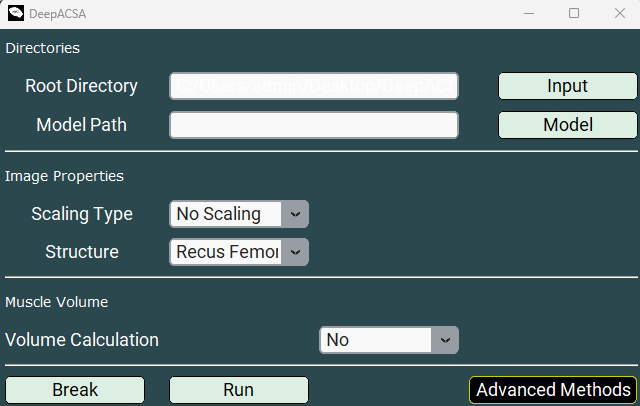

  Main GUI Window

In the following sections, the functionalities of DeepACSA are presented using a single, consistent example. This example serves as a common thread and is referenced throughout the sections.

.. _removeparts:

Removing image parts
""""""""""""""""""""
Assume that, in your laboratory, you have acquired transverse ultrasound images of the rectus femoris muscle at different percentages of femur length in 60 subjects. Before proceeding with further analysis, it may be useful to crop or mask additional information displayed by the ultrasound machine that could mislead automated processing. This step is also recommended for data anonymization, particularly when filenames or patient information are consistently displayed in the same image location. 

| If you plan to delegate the analysis or prepare the data for publication, working in a blinded manner with anonymized images is strongly advised to reduce potential bias.
| DeepACSA provides a dedicated functionality to remove such regions, allowing you to work with cleaner and anonymized data. The example below illustrates the use of this feature:

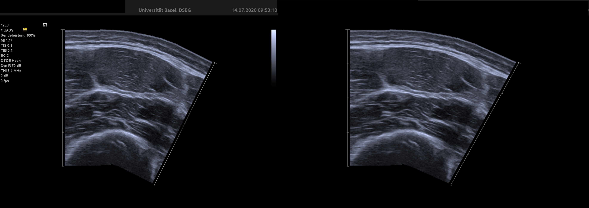

  Left: original image containing non-relevant and personal overlay information. Right: cleaned image with superfluous information removed.
  
1. Before starting, ensure that the region you intend to remove is consistently located across all images to be edited. Only one selection can be made and it will be applied to every image in the directory. 
2. Launch the GUI and select ``Remove Image Parts`` from the ``Advanced Methods`` menu.
3. In the newly opened window, click ``Load Image`` to select the directory containing the images you wish to clean or anonymize.
4. After selecting the directory, a new window will open displaying the first image.
5. Left-click and drag to select the area you wish to cover with a black rectangle. If you misclick, simply click and drag again; the previously selected area will be replaced.

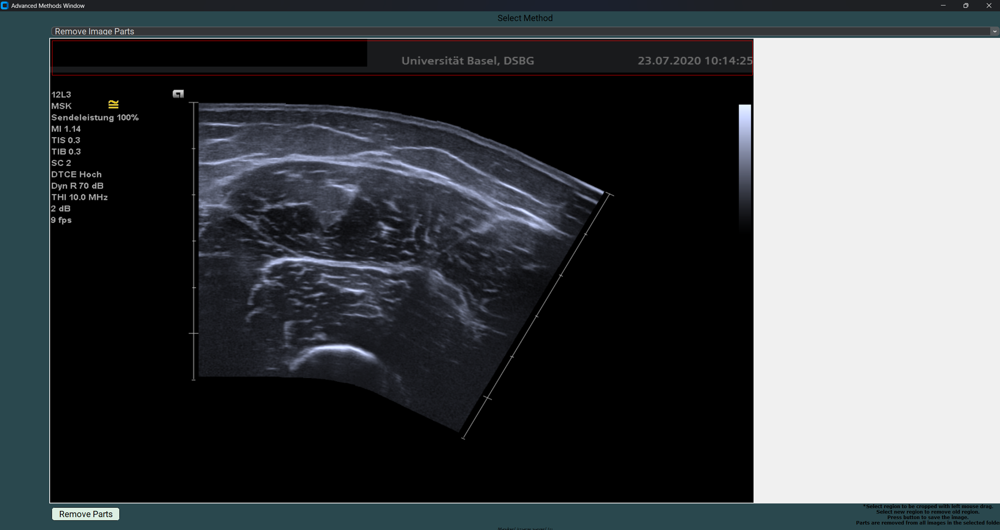

  GUI for removing image parts, with the selected region highlighted in red.

6. After selecting the desired area, click ``Remove Parts`` to remove the selected pixel region **from all images in the directory**.
7. Once the process is complete, close the ``Remove Image Parts`` window by clicking the **X** in the upper-right corner.
8. A new folder named ``Processed`` will appear in the input directory, containing the edited images.
9. Multiple regions cannot be selected within a single run. To remove an additional area, close the ``Remove Image Parts`` window, reopen it, select the newly created ``Processed`` folder as the input directory, and repeat the procedure.

.. _datalabel:

Data labelling
""""""""""""""

After preprocessing and anonymizing your images, the next step is to prepare your dataset for model development.
If no trained model is available, the first step is to manually identify and segment the anatomical cross-sectional area (ACSA) in each image. This process allows you to determine the ACSA of the subject's rectus femoris, with the output reported in cm².

This step is called data labelling and, together with data preparation, is the most important stage of model training.

DeepACSA provides a dedicated functionality that enables manual labeling of images and the creation of corresponding segmentation masks.

1. After launching the GUI click the ``Advanced Methods`` button.
2. Select the ``Create Masks`` option. The ``Create Masks Winow`` will open. 

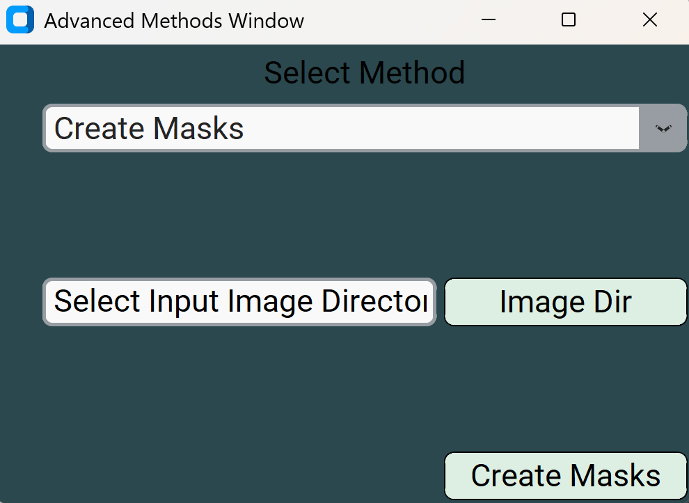

  Create Masks Window.

3. Click the ``Image Dir`` button to select the folder containing the images you want to label. All images must be stored in a single folder without subfolders.
4. Start the mask creation process by clicking the ``Create Masks`` button. Two folders will be created in the directory specified under ``Image Dir``: **_images** and **_masks**. The original images are copied to *_images*, and the corresponding binary masks are saved in *_masks* using the same filename with a *.tif* extension.
5. The first image will open automatically. After completing the analysis of one image, the next image in the directory will open sequentially.
6. The first thing to do is scaling the image. Left-click on two points that are exactly 1 cm apart **(red points)**. If you misclick, remove the most recent point by right-clicking on the image. After selecting the two scaling points, the scaling factor will be displayed in the terminal. 
7. You will then be prompted to segment the muscle ACSA by repeatedly left-clicking around the muscle boundary **(blue points)**. Incorrect points can be removed by right-clicking.

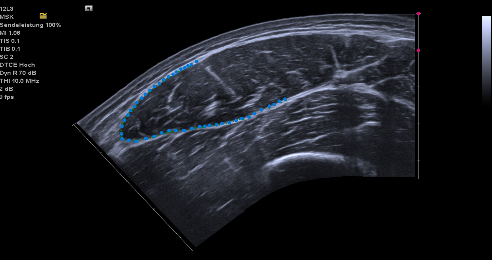

  Scaled image (red dots) being segmented (blue dots).

8. Once segmentation is complete, press ``Enter`` to finalize the labeling and proceed to the next image. Image filenames are incremented automatically based on the number of files already present in these folders. The calculated ACSA expressed in cm² will be displayed in the terminal. To interrupt the analysis at any time, press ``Esc``.
9. After each successfully analyzed image, the renamed image and corresponding mask are saved in their respective folders. In addition, the filename and calculated ACSA are appended to the **Areas.csv** file. Because the results are reported in cm², accurate scaling is essential.
10. If you stop the analysis before processing all images in the selected ``Image Dir``, move any already analyzed images (**_images** folder), masks (**_masks** folder), and the generated **Areas.csv** file before restarting the procedure.
11. Do not delete the **_images**, **_masks** or **Areas.csv** files, as they contain the labeled images and corresponding masks. Moving them is only necessary to avoid labeling duplicates.

**If the GUI becomes unresponsive after the labeling process, restart the application before continuing.**

.. _augmentlabel:

Image Augmentation
""""""""""""""""""
Assume that you have completed the manual labeling process for 30 participants. With an additional 30 participants remaining to be analyzed, you decide to train a custom model to make the analysis faster and more objective.
Training a model at this stage using data from only 30 participants may result in limited generalization performance, as the dataset size is relatively small.

To address this challenge, you can apply **image augmentation**. This process artificially increases the size of the training dataset by generating additional image–mask pairs through operations such as **flipping, rotation, and translation** of original images.

The purpose of image augmentation is to improve model robustness and generalization by exposing the model to a greater variety of training examples.

For more detailed information about the augmentation procedure, please refer to our `paper <https://journals.lww.com/acsm-msse/Abstract/2022/12000/DeepACSA__Automatic_Segmentation_of.21.aspx>`_ or to the corresponding functions described in the documentation.

1. After launching the GUI click the ``Advanced Methods`` button and select the ``Train Model`` option.
2. Before starting the augmentation process, make sure to create a backup copy of your original images and masks.

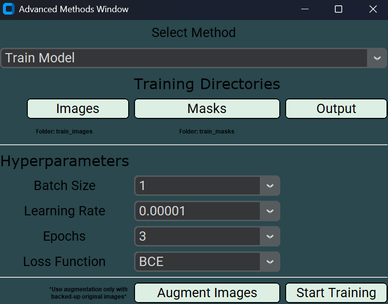

  GUI seetings to augment the dataset.

3. Click the ``Images`` button to select the directory containing the images you want to augment. 
4. Click the ``Masks`` button to select the corresponding masks directory. 
5. Click ``Augment Images``. The process may take a couple of minutes, depending on the number of image–mask pairs being augmented.
6. Once the augmentation process is complete, a pop-up window will indicate successful execution. The augmented images and masks (augmented threefold) are saved in the same directories that were selected as input.

.. _trainlabel:

Train your own networks
"""""""""""""""""""""""

| *At this stage, having a functional GPU setup is advantageous, otherwise model training will take much longer. as model training can otherwise take considerably longer. Instructions for setting up the DeepACSA GUI are provided in the* :ref:`installation section <gui_setup_ref>`.
| *While several training parameters can be adjusted from the GUI, the neural network architecture itself cannot be modified without editing the source code.*

*Explaining the adjustable training parameters in detail is beyond the scope of this tutorial. If you are new to deep learning, we recommend* `this excellent introductory course <https://deeplizard.com/learn/video/gZmobeGL0Yg>`_.
*Training a custom network for muscle ACSA analysis requires paired original images and manually labeled binary masks. Example data are available in the* ``DeepACSA_example_v0.3.2/model_training`` *folder. If you have not yet downloaded this folder, please do so from this* `link <https://doi.org/10.5281/zenodo.8419487>`_, *extract the archive, and place it on your desktop.*

Continuing with our example, assume that you have augmented your dataset and are now ready to train your own model. This will allow the images from the remaining 30 subjects to be analyzed objectively and more efficiently.

1. Organize your data so that all training images are stored in one folder and the corresponding binary masks *(with identical filenames and a* **.tif** *extension)* are stored in a separate folder.
2. Launch the GUI and select ``Train Model`` in the ``Advanced Methods`` menu.
3. Click ``Images`` to specify the directory containing your training images.
4. Click ``Masks`` to specify the directory containing the corresponding training masks. 
5. Click ``Output`` to specify the directory where all training outputs will be saved.
6. Specify the ``Batch Size`` manually or using the drop-down menu. Keep in mind that the batch size should be proportional to your available computational resources (e.g., limited RAM or no GPU requires a smaller batch size).
7. Specify the ``Learning Rate`` manually or using the drop-down menu if you wish to modify the default value.
8. Choose the number of ``Epochs`` manually or using the drop-down menu. For actual model training, **use more than 3 epochs**. The default value of 3 is intended for testing purposes only.
9. Select a ``Loss Function`` from the drop-down menu. Currently, the only implemented option is **binary cross-entropy (BCE)**.
10. Click ``Start Training`` and follow the instructions provided in the pop-up messages. Once training has started, a live preview of the training metrics will be displayed in the terminal.
11. Once the training is complete, three files will appear in the specified ``Output Directory``:

  * ``Test_apo.csv`` - contains the following metrics recorded per epoch: IoU, accuracy, loss, learning rate *(lr)*, validation IoU *(val_IoU)*, validation accuracy *(val_accuracy)*, and validation loss *(val_loss)*.
  * ``Test_Apo.h5`` – the trained model file.
  * ``Training_Results.tif`` – a plot of the training and validation curves across epochs.

**Restart the GUI when model training is completed to successfully use the trained models.**

.. _automatic_analysis_label:

Analyzing images with a model
"""""""""""""""""""""""""""""

**Disclaimer:** Before applying your own trained model, its validity and reliability should be evaluated.
Now that you have trained your own model, you are ready to apply it to analyze the images from the remaining 30 participants.

1. After launching the GUI, the main window will open. This is the window used for image analysis.
2. First, click ``Input`` to select the root directory containing the images to be analyzed.
3. Then, click ``Model`` to select the trained model file that will be used for analysis.
4. Select the anatomical ``Structure`` to be analyzed from the drop-down menu. The currently implemented structures are rectus femoris, vastus lateralis, vastus medialis, gastrocnemius lateralis, gastrocnemius medialis, biceps femoris, and patellar tendon.
5. DeepACSA provides four ``Scaling Types``, each designed for a specific image type. Select the most appropriate option based on your image characteristics:

  **A.** ``Line Scaling``:

  You should use this scaling type when the image contains a continuous straight reference line with markers at regular intervals, as shown in the example below.

    .. figure:: RF_line_scale.png
      :scale: 60 %
      :alt: RF_line_scale

      Rectus femoris image with line scaling and highlighted intervals.

  To ensure proper scaling, you will be prompted to enter the ``Depth (cm)`` at which the image was acquired. This information is required to convert pixel values to cm² and it should always be recorded during image acquisition.

  All images analyzed within a single run must have been acquired at the same depth. If your dataset includes images acquired at different depths, organize them into separate folders and repeat the analysis process for each folder using the corresponding depth value.

  **B.** ``Bar Scaling``:

  This scaling type is used when multiple scaling bars are present at regular intervals instead of a continuous reference line, as shown in the image below.

    .. figure:: RF_bar_scale.png
      :scale: 47 %
      :alt: RF_line_scale

      Rectus femoris image with bar scaling.

  For this analysis type, you will be prompted to specify the ``Spacing (mm)``, i.e. the distance in millimiters, between two horizontal scaling bars. As in the previous example, this information is required to convert pixel values to cm² and should always be recorded during image acquisition.

  As described above, images with different spacing values must be analyzed in separate runs, since the spacing can only be specified once per run.

  **C.** ``Manual Scaling``:

  For the manual scaling type, the scale must be defined individually for each image to be analyzed. This option is useful when the automatic scaling methods fail to correctly detect the scale, or when certain images cannot be processed using the other scaling types. 
  Whenever possible, we recommend using one of the fully automatic scaling types instead.

  Once the analysis is started, you will be prompted to left-click on two points in the image that are exactly 1 cm apart. After placing the two points, press the **q key** to continue.
  If you misclick, simply click again to reset the scaling points. The scaling factor is always calculated based on the last two points placed. Although only one point is visible at a time, the scale is still computed correctly.

    .. figure:: manual_scale.png
      :scale: 50 %
      :alt: manual_scale

      Rectus femoris image with one white manual scaling point on the scaling line.

  After placing two points and pressing the **q key**, a pop-up window will appear displaying the scaling factor used to convert pixels to cm, as shown in the example below.
    
    .. figure:: scale_result.png
      :scale: 100 %
      :alt: scale_result
      
      Pop-up window displaying the scaling factor used to convert pixels in cm.
  
  After clicking ``OK``, the process will repeat for each image in the selected root directory.
  If you interrupt the analysis before processing all images, move the already analyzed images, the ``Analyzed_images.pdf`` file, and the ``Results.xlsx`` file to a different directory before restarting the procedure. This prevents duplicate processing and unintended overwriting of data.

  **D.** ``No scaling``:

  The final option is to run the analysis without applying any scaling. In this case, the ACSA values will be returned in pixels rather than in cm.
  
  This approach is useful when the scale factor is already known and consistent across multiple images but cannot be automatically detected by the other scaling methods. It may also be suitable for quick exploratory comparisons where absolute area values are not required, or when images have already been calibrated or preprocessed externally prior to being loaded into DeepACSA.

6. Click ``Run``.
7. After the analysis is complete, two files will appear in the directory containing your images:

* ``Analyzed_images.pdf`` contains the normalized and resized images with the predicted muscle area overlaid, as shown in the example below. This file allows you to visually assess the quality and validity of the model predictions.

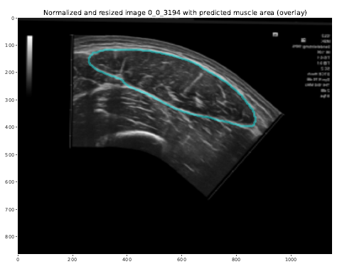
  
  Original image with the predicted ACSA boundary overlaid in light blue.

* | ``Results.xlsx`` provides, for each image, the filename, selected anatomical structure, predicted area (in cm² or pixels if no scaling was applied), echo intensity, area-to-circumference ratio, circumference, and, if selected, the calculated muscle volume in cm³.
  | It is important to note that the current models have been validated only for ACSA measurements. All other reported metrics are provided for additional information and should be interpreted with caution.    

8. For the line and bar scaling types, the ``Analyzed_images.pdf`` file also includes a visual representation of the applied scaling. This allows you to verify that the scaling has been correctly detected, as shown in the example below.

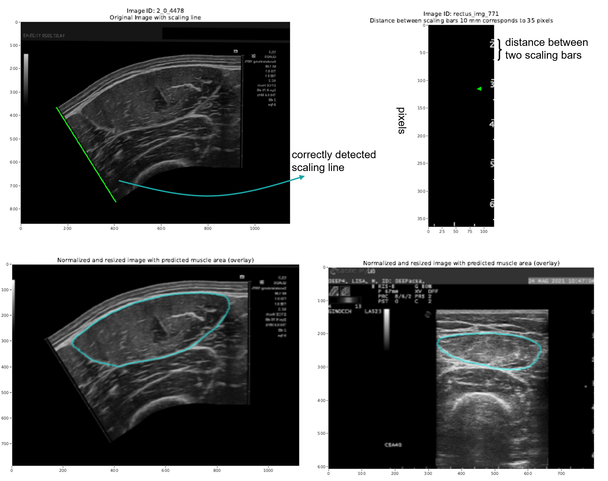
  
  **Left:** correctly detected line scaling, with a green line spanning the full reference scale in the image.
  **Right:** correctly detected bar scaling, showing the pixel scale on one side and the distance between two bars on the other.

9. If you select an automatic scaling method, it may fail for certain images. In such cases, an additional file named ``failed_images.txt`` will appear in the image directory. This file lists the images for which scaling was unsuccessful. Each line corresponds to one failed image, for example ``Scaling line not found in C:/path/to/your/image/image.tif``

.. _masklabel:

Mask / label inspection
"""""""""""""""""""""""
Assume that you have completed the analysis of all 60 subjects and now wish to verify that the ACSA segmentation of the rectus femoris is correct for each image.
DeepACSA allows you to visualize the binary mask overlaid on the original image to identify clearly erroneous segmentations or predictions. Based on this assessment, inaccurate segmentations can be discarded and, if necessary, the image can be reanalyzed manually.

1. For this inspection, organize all images in a single folder without subfolders. Store the corresponding binary masks (**with identical filenames**) in a separate folder, also without subfolders.
2. After launching the GUI, select the ``Inspect Mask`` option from the ``Advanced Methods`` menu to open the mask inspection window.
3. Click ``Image Dir`` to specify the directory containing your images, then click ``Mask Dir`` to select the directory containing the corresponding binary masks.
4. Optionally, you can choose the image from which to begin the inspection by specifying its zero-based index in the ``Start at Image:`` field. By default, inspection starts from the first image.

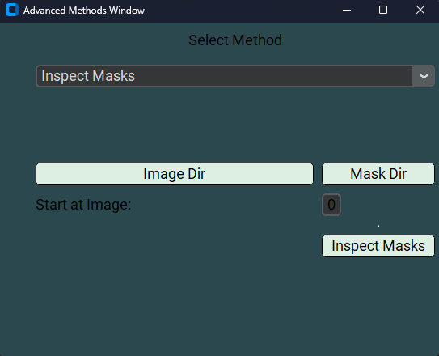

  Inspect Masks Window.

5. Click ``Inspect Masks`` to verify your image–mask pairs. An information window will appear indicating whether the image and mask directories are correctly organized. Specifically, it checks that both directories contain the same number of files and that corresponding images and masks share identical filenames. If inconsistencies are detected, they will be reported in a pop-up window similar to the example shown below.

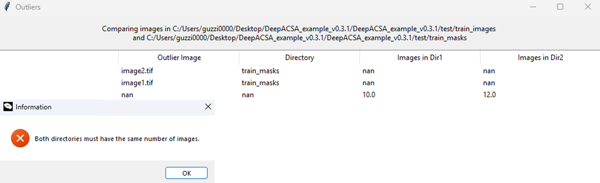

  Information window displayed when two masks are found without corresponding images in the image folder. The table indicates the files that have no matching counterpart in the complementary directory.

6. After clicking ``OK``, a new window will open displaying the first image–mask pair.

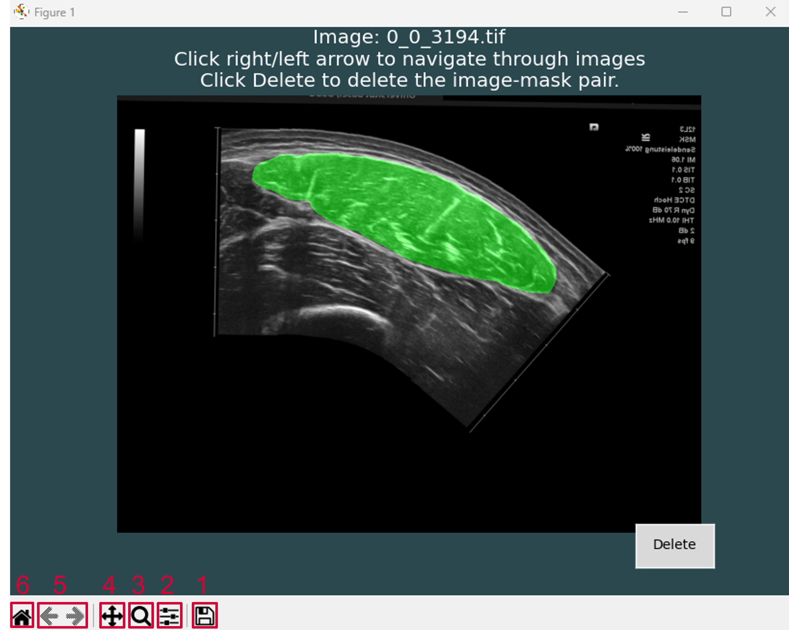

  Inspect Masks Window.

7. Here, you can scroll through all images with the overlaid masks using the **left and right arrow keys** and inspect them for potential errors. Ensure that the masks fully cover the muscle area and do not overlap with adjacent muscles or aponeuroses, nor exclude portions of the muscle region. To facilitate inspection, DeepACSA provides a navigation menu in the bottom-left corner of the window.
  
  * The **Save** button (1) allows you to save a screenshot of the current GUI setup, with or without zoom.
  * The **Configure Subplots** button (2) allows you to adjust the image position within the GUI for improved visualization.
  * The **Zoom** button (3) allows you to zoom into a specific area by drawing a rectangle. Left-click and drag to zoom in; right-click and drag to zoom out.
  * The **Pan** button (*four arrows icon*) (4) allows you to move the image and zoom locally. Left-click and drag to move the current view; right-click and drag to zoom in or out around the selected point.
  * The **Back** and **Forward** arrows (5) allow you to navigate between previous visualization states.
  * The **Home** button (6) restores the original view of the image.

8. If errors are detected, you can relabel images using the ``Create Masks`` functionality or delete the image–mask pair using the ``Delete`` button. Note that clicking ``Delete`` permanently removes the image–mask pair from both directories; therefore, always keep a backup copy of your original images.
9. Below is an example of a correctly predicted ACSA and an erroneous prediction that was clearly missegmented.

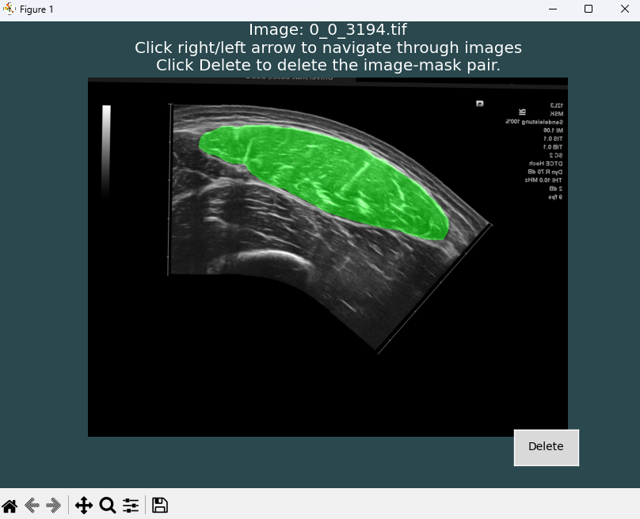

  Correctly labelled image.

.. figure:: inspect_incorrect.png
  :scale: 60 %
  :alt: inspect_figure

  Incorrectly labelled image.

.. _volumelabel:

Calculate muscle volume
"""""""""""""""""""""""

Now that you have verified that all acquired images have been correctly analyzed and that the ACSA values are accurate, you may proceed to calculate an approximation of the rectus femoris muscle volume for each one of your subjects.

DeepACSA employs the truncated cone formula to estimate muscle volume. Before performing volume calculations using DeepACSA, several important considerations should be kept in mind:

* Muscle volume calculation can only be performed when multiple images of the same muscle from the same participant, acquired at different muscle regions, are available and stored in a single folder.
* The images **must** be named in order from proximal to distal (i.e., ``img0.tif``, ``img1.tif``, ``img2.tif``, ..., ``imgN.tif``).

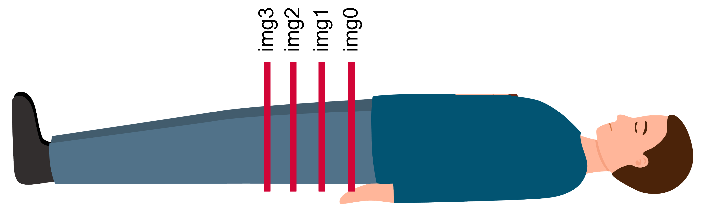

  File naming in the correct proximal-to-distal order.

* The distance (**in cm**) between consecutive images must be known and constant.
* Increasing the number of images improves the accuracy of the volume estimation.

1. To calculate muscle volume, launch the main GUI and select the folder containing images of the same muscle from the same participant, acquired at different regions, as the ``Root Directory``.
2. Select the ``Model Path`` corresponding to the trained model you wish to use.
3. Specify the ``Scaling Type`` and ``Structure`` as described in the :ref:`automatic analysis section <automatic_analysis_label>`.
4. In the muscle volume section, select ``Yes`` from the ``Volume Calculation`` drop-down menu. 
5. Enter the ``Slice Distance (cm)`` corresponding to the **costant** distance between the acquired images.
6. Click ``Run``. The muscle volume will be calculated by combining all ACSA measurements from the images in the ``Root Directory`` and will be displayed at the bottom of the ``Results.xlsx`` table.

