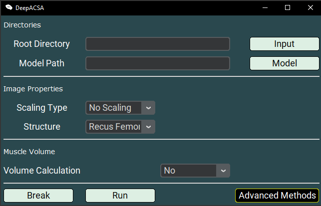

.. _usagelabel:

Usage
=====

Welcome to the DeepACSA tutorial. 
Here you will learn how to automatically analyse ultrasonography images of human lower limb muscles. 
You will do so by making extensive use of the graphical user interface provided by DeepACSA. 
The basics on how to use the GUI are demonstrated in this `video <https://www.youtube.com/watch?v=It9CqVSNc9M>`_. 
You can find the details on how to start the graphical user interface, how to train your own neural networks and how to calculate muscle volume below. 
Have fun!

Not included in the video:
--------------------------

- Loss Function: In the new version of the GUI, you can find a ``Loss Function`` dropdown under the ``Model Path`` textentry. Here you need to specify the loss function used during model training. So far, we implemented *IoU*, *Focal Loss* and *Dice Loss*. When using our pre-trained models, simply select *IoU*. 
- Model Training (see :ref:`trainlabel`)
- Image Labelling (see :ref:`datalabel`)
- Mask Inspection (see :ref:`masklabel`)
- Image Augmentation (see :ref:`augmentlabel`)
- Volume Calculation (see :ref:`volumelabel`)

**Please note that the video is using an older version of DeepACSA. The GUI has been updated since then, but the overall workflow remains the same.**

**Attention MacOS users:**
The DeepACSA package is only fully functional on windows OS and was not properly tested on MacOS. However, with restricted functionality macOS users can employ the DeepACSA as well. With macOS, the manual scaling option for image analysis is not functional. Therefore, images cannot be scaled this way in the GUI. A possible solution is to scale the analysis results subsequent to completion of the analysis. Therefore, the pixel per centimeter must be calculated elsewhere. One option is to use `FIJI <https://imagej.net/software/fiji/downloads>`_. By drawing a line on the image, it is possible to see the length of the line in pixel units. Open the respective image in FIJI by drag and drop. Draw a line on the image with a known distance of one centimetre, click `cmd + m` and get the length of the line in pixel unit from the result window. Do that for every image with varying scanning depth. Divide the analysis results for muscle thickness and fascicle length by the linelength in pixel units. The result will be the muscle thickness and fascicle length in centimeter units.

Good to know
------------

All relevant instructions and guidelines for the installation of the DeepACSA software are described in the installation section, so please take a look there if anything is unclear. We have also provided information on what to do when you encounter problems during the installation process, encounter errors during the analysis process that are not caught by the GUI (no error message pop ups and advises you what to do), if you want to contribute to the DeepACSA software package, and how you can reach us.

Before we start with this tutorial, here are some important tips:

- In case you plan an analysis on images taken from different muscles, we strongly advise to 
  test the algorithm first and in case of bad performance, train your own models. We have provided 
  extensive documentation on how to do so in the section “Training your own network” in this tutorial.

- Although we used extensive data augmentation during the model training process, we must 
  caution you about the generalizability of our models. Deep learning is no magic! Even though our model demonstrated good performance on unseen images during testing, we cannot confidently claim that they will work fine on all lower limb ultrasonography images.
  It is possible that even for images of muscles represented in our training data set, different device types, different muscle regions and even different settings of ultrasonography devices during image acquisition might offset model performance. 

- Quality matters! Please pay attention that the images you want to analyse with DeepACSA are 
  of high quality. High quality means good image contrast, appropriate image brightness, clearly visible fascicles and aponeurosis and clear alignment of the probe with the fascicle plain. If the quality of the images you want to analyse is bad, the results will be as well.

- Bad model performance can be detected. The first and easiest step to take is to visually 
  inspect the output of the models. If the segmentation results and the actual aponeuroses overlap on most of the analysed images, model performance is good. If not, adapt the analysis parameters (how to do so is covered in the tutorials) or train a separate model. Secondly, you should manually analyse a few of your images and compare the model results to your manual results. If both results are similar, model performance is good. If not, train a separate model.

Starting the interface
----------------------

In the very first step of this tutorial, we will take a look at how to start the graphical user interface (GUI) once it was installed. We have provided three different installation procedures: 

1. downloading the DeepACSA.exe `file <https://doi.org/10.5281/zenodo.8419487>`_

2. installing the DeepACSA python package with pip, Pypi or locally.

Let's begin with 1., how to start the GUI when you downloaded the DeepACSA.exe: 
It doesn't get any easier than this. Navigate to the downloads folder and place the DeepACSA.exe file somewhere you can easily find it again. Done so, you just have to double click the DeepACSA.exe file with your left mouse button to start the GUI. Once you’ve done that, the GUI should open and you are ready to start an analysis.

Now to 2., how to start the GUI when you installed the DeepACSA python package via Pip, Github and Pypi:
There are essentially two ways you can start the GUI. But first lets make sure that DeepACSA was correctly installed. The package should be included in the conda virtual environment, as you probably installed it locally in your machine. Therefore, open a prompt and activate the environment by typing 

``conda activate DeepACSA``

If this does not work, go back to the Installation section (see :ref:`installlabel`).
You should see the activated environment now in the left round brackets. Next type

``conda list``

to see all packages installed in the DeepACSA environment. When DeepACSA is included, you are good to go. If this is not the case, navigate to the source folder of DeepACSA (with the pyproject.toml file) in your prompt. Type

``python -m pip install -e .``

to install the package locally (for more information, see section Installation (see :ref:`installlabel`))
Check again if the package is listed inside the environment now. If you still encounter a problem, ask a question in the Q&A discussion section of DLTrack on Github and add the Label “Problem”.

However, if DeepACSA is included in the conda environment, type 

``python -m Deep_ACSA`` 

to start the GUI. The location of you prompt is irrelevant, as long as the DeepACSA conda environment is activated. The main GUI window should open now.

    Main GUI Window

.. _trainlabel:

Train your own networks
-----------------------

It is advantageous to have a working GPU setup, otherwise model training will take much longer. 
How to setup you GUI for DeepACSA is described above and in the installation section. 
Although you can adapt a number of parameters during training, you cannot change the neural network architecture from the GUI (of course you could modify source code to do so). 
To explain the parameters used during model that are adaptable from the GUI is out of the scope of this tutorial. However, we would like to refer you to `this excellent introductory course <https://deeplizard.com/learn/video/gZmobeGL0Yg>`_ in case you are a deep learning beginner.
Training your own networks for muscle architecture analysis requires pairs of original images and manually labelled masks. Examples are provided for you in the “DeepACSA_example/model_training” folder. If you haven't downloaded this folder, please do so now (`link <https://doi.org/10.5281/zenodo.8419487>`_). Unzip the folder and put it somewhere accessible, for example on your desktop.

.. _datalabel:

Data labelling
""""""""""""""

The most important part for model training is data preparation and labelling.
We have provided a functionality inside DeepACSA that allows you to label your images and create the masks.
1. Start the GUI and click the ``Advanced Methods`` button.
2. Select the ``Create Masks`` option. The ``Create Masks Winow`` will open. 

.. figure:: create_masks.png
  :scale: 50 %
  :alt: create_masks_figure

  Create Masks Window.

2. In the ``Image Dir``, specify the path to the images you want to label by clicking the ``Image Dir`` button. These images should be contained in a single folder with no subfolders.
3. Start the mask creation by clicking the ``Create Masks`` button. Two folders will be created in the ``Image Dir`` folder: *train_images* and *train_masks*. The original images will be copied to *train_images* and the masks will be saved in *train_masks* with the same filename but a ".tif" extension.
4. An information window opens telling you to scale the images. Click ``OK`` to continue.
  
.. figure:: mask_info.png
  :scale: 50 %
  :alt: mask_info_figure

  Mask Scaling Info.
  
5. Another GUI will open. Create the mask by clicking on the image. Follow the instructions in the GUI. Repeat this process for all images in the selected ``Image Dir``.

.. figure:: make_mask.png
  :scale: 50 %
  :alt: make_mask_figure

  Mask Creation GUI.

All images in the selected folder will be used during mask creation. Please remeber to remove already labelled images from the seleccted ``Image Dir`` to not label them twice. *DO NOT* delete the ``train_images`` and ``train_masks`` folder as those contain your labelled images and leave the masks and renamed images in those folders as well as the image names will be incrementally increased based on the number of images contained in the folders.
In addtion to the renamed images, the analysis results (ACSA) are saved to an excel file which is why the scaling step is necessary. Thus, the *mask creation can also be used for manual image analysis*.

**It might be necessary to restart the GUI subsequent to the labelling process in case of non-responsiveness**

.. _masklabel:

Mask / label inspection
"""""""""""""""""""""""

1. Start the GUI and click the ``Advanced Methods`` button.
2. Select the ``Inspect Masks`` option. The ``Inspect Masks Winow`` will open.

.. figure:: inspect.png
  :scale: 50 %
  :alt: inspect_figure

  Inspect Masks Window.

3. In the ``Image Dir``, specify the path to the images you want to label by clicking the ``Image Dir`` button. These images should be contained in a single folder with no subfolders.
4. In the ``Mask Dir``, specify the path to the images you want to label by clicking the ``Mask Dir`` button. These masks should be contained in a single folder with no subfolders.
5. Change the ``Start Index``, in case you don't want to start at the first image.
6. Clik the ``Inspect Masks`` button to check you training images and masks. Another GUI will open.

.. figure:: inspect.png
  :scale: 50 %
  :alt: inspect_figure

  Inspect Masks Window.

7. An Information window will appear telling you if a similar amount of images / files are in the image and mask directories as well as whether they are names similarly. **Images and respective masks must have the same filename for proper pairing during training.**

.. figure:: inspect_info.png
  :scale: 50 %
  :alt: inspect_figure

  Inspection Information.
  
8. By clicking ``OK``, the inspection window will open. Here you can scroll through all your images with overlays masks and check for any errors. Please ensure masks cover muscle area completely and do not overlap with other muscles /aponeuroses or exclude muscle regions. 
If errors are found, relabel images using create masks functionality or simply delete the image / label pair using the ``Delete`` button.

.. figure:: inspect_correct.png
  :scale: 50 %
  :alt: inspect_figure

  Correctly labelled image.

.. figure:: Inspect_incorrect.png
  :scale: 50 %
  :alt: inspect_figure

  Incorrectly labelled image.

.. _augmentlabel:

Image Augmentation
""""""""""""""""""

Prior to model training, it is possible to augment your images. The main goal is to enlarge the training data size.
For detailded information about the augmentation process take a look at our `paper <https://journals.lww.com/acsm-msse/Abstract/2022/12000/DeepACSA__Automatic_Segmentation_of.21.aspx>`_ or at the respective functions in the docs. 
1. Start the GUI and click the ``Advanced Methods`` button.
2. Select the ``Train Model`` option.
2. In the ``Image Directory``, specify the path to your training images by pressing the ``Images`` button.
3. In the ``Mask Directory``, specify the path to your training masks by pressing the ``Masks`` button. 
4. Click the ``Augment Images`` button and the augmentation process starts. 
The image augmentation process starts and the images will be augmented three-fold.

Model Training
""""""""""""""

1. Start the GUI and click the ``Train Model`` button.
2. In the ``Image Directory``, specify the path to your training images by pressing the ``Images`` button.
3. In the ``Mask Directory``, specify the path to your training masks by pressing the ``Masks`` button. 
4. In the ``Output Directory``, specify the path to your output directory by pressing the ``Output`` button. Here, all the files from the training process will be saved.
5. Specify a ``Batch Size``. You can enter a value you like, but be cautioned to keep it proportional to your available computing power (i.e., smaller available RAM or no GPU = smaller ``Batch Size``).
6. Specify the ``Learning Rate``. Enter a value if you prefer a different learning rate than the default.
7. Choose a number of ``Epochs``. *Please pay attention to user MORE than 3 ``Epochs`` during actual model training*. We entered 3 as default for testing purposes, otherwise testing would take forever.
8. Define a ``Loss Function``. So far, you can choose binary cross-entropy (BCE), focal loss (FL) and dice loss (Dice).
9. Press the ``Start Training`` button and follow the instructions given by the pop-up messages. As stated above, the trained model will be in the ``Output Directory`` once the traing is completed.

**Restart the GUI when model training is completed to sucessfully use the trained models.**

.. _volumelabel:

Calculate muscle volume
-----------------------

Here we employ the truncated cone formula to calculate the muscle volume. To calculate the volume of a muscle using DeepACSA, several prerequisites are important:

- Muscle volume calculation can only be done when several images of the same muscle across several muscle regions are available and stored in the same folder.
- The images **must** be named in order from proximal to distal (i.e, img0.tif, img1.tif, img2.tif, ..., imgN.tif).
- The distance between the images of different muscle regions is knwon and constant.
- The higher the number of images, the more accurate the volume calculation.

1. Once all prerequisites are fullfilled, select the folder conatining the images of the same muscle and different regions as ``Root Directory``.
2. Choose a ``Model Path`` to the model you wish to use and specify all other parameters in the GUI accordingly. 
3. In the ``Muscle Volume`` section, select the checkbox ``Yes`` for ``Volume Calculation`` and specify the ``Distance`` as the distance between the images you collected.
4. Proceed to press the button ``Run`` and the muscle volume will be calculated combining all ACSA measurements of the images in the ``Root Directory`` and will be displayed in the .xlsx result file. 
